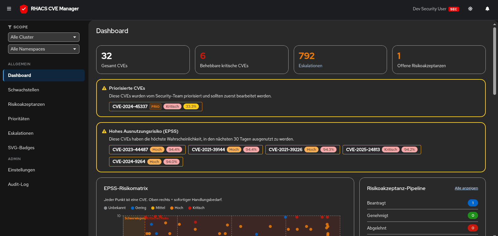

<p align="center">
  <h1 align="center">RHACS Manager</h1>
  <p align="center">
    Self-service CVE management for OpenShift RHACS with EPSS-driven prioritization
  </p>
</p>

<p align="center">
  
  
  
  
  
  
  
  
</p>

<br />

<p align="center">
  <a href="ui.png">
    
  </a>
</p>

<br />

## Overview

RHACS Manager provides namespace-scoped CVE visibility derived from Kubernetes RBAC. Security teams get org-wide oversight while regular users see only CVEs affecting their namespaces. EPSS probability scoring drives prioritization, helping teams focus on the vulnerabilities that matter most.

## Key Features

- **EPSS-driven prioritization** — Focus on exploitable CVEs, not just severity
- **K8s RBAC scoping** — Automatic namespace access from cluster annotations
- **Risk acceptance workflows** — Request, approve, and track CVE risk acceptances
- **Escalation management** — Namespace-scoped escalation tracking with auto-escalation
- **Live dashboards** — EPSS risk matrix, cluster heatmap, CVE aging, severity distribution
- **Hub-spoke architecture** — Central backend with lightweight spoke proxies per cluster
- **Email notifications** — Configurable digests and escalation alerts via SMTP
- **Embeddable badges** — SVG status badges for dashboards and docs

## Architecture

```
Spoke Cluster                                    Hub Cluster
┌──────────────────────────────────────┐        ┌──────────────────────┐
│ Route → OAuth Proxy → Namespace     │        │ Route → FastAPI      │
│          (OIDC)       Resolver (Go) │───────▶│        ├─ StackRox DB│
│                       → Nginx (SPA) │ API    │        └─ App DB     │
└──────────────────────────────────────┘        └──────────────────────┘
```

## Quick Start

```bash
# Prerequisites: PostgreSQL, Node.js, Python 3.12, uv, just

# Start dev server (sec team user)
just dev

# Start as regular user with namespace access
just dev user payments:cluster-a

# Run tests
just test

# Lint
just lint
```

## Tech Stack

| Layer | Technology |
|-------|-----------|
| Frontend | React 19, Vite, PatternFly 6, TanStack Query 5, react-i18next |
| Backend | FastAPI, SQLAlchemy 2 (async), Alembic, Pydantic v2 |
| Runtime | Python 3.12, uv |
| Databases | PostgreSQL (app) + StackRox Central DB (read-only) |
| Auth | OpenShift OAuth / OIDC JWT / Dev mode |
| Deploy | Kustomize, OpenShift, multi-stage container builds |

## Deployment

```bash
# Hub (backend + frontend + databases)
kubectl apply -k deploy/hub/

# Spoke (frontend + oauth-proxy + namespace-resolver)
kubectl apply -k deploy/spoke/

# Hub via Helm
helm upgrade --install rhacs-manager deploy/helm/rhacs-manager \
  -n rhacs-manager --create-namespace

# Spoke via Helm
helm upgrade --install rhacs-manager-spoke deploy/helm/rhacs-manager \
  -n rhacs-manager --create-namespace \
  --set mode=spoke \
  --set spoke.oauthProxy.cookieSecret='<base64-32-byte-secret>'
```

## Project Structure

```
├── backend/           FastAPI backend (hub only)
│   ├── app/
│   │   ├── routers/   API endpoints
│   │   ├── models/    SQLAlchemy ORM models
│   │   ├── stackrox/  Read-only StackRox queries
│   │   └── tasks/     Background jobs
│   └── alembic/       Database migrations
├── frontend/          React SPA
│   └── src/
│       ├── pages/     One file per route
│       ├── components/Reusable UI
│       └── i18n/      German translations
├── namespace-resolver/Go sidecar for K8s RBAC
├── deploy/            Kustomize manifests
│   ├── base/          Shared resources
│   ├── hub/           Hub overlay
│   └── spoke/         Spoke overlay
└── justfile           Dev workflow commands
```
