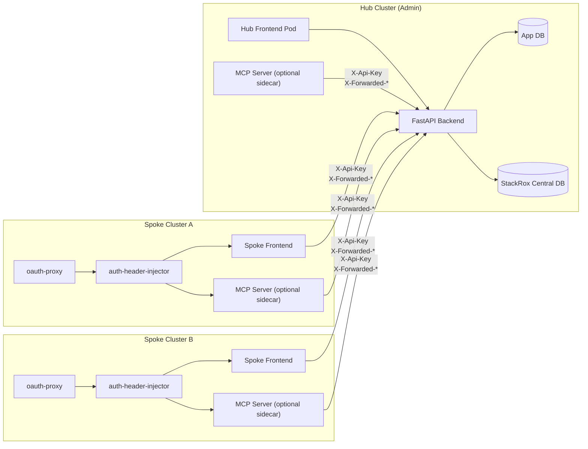
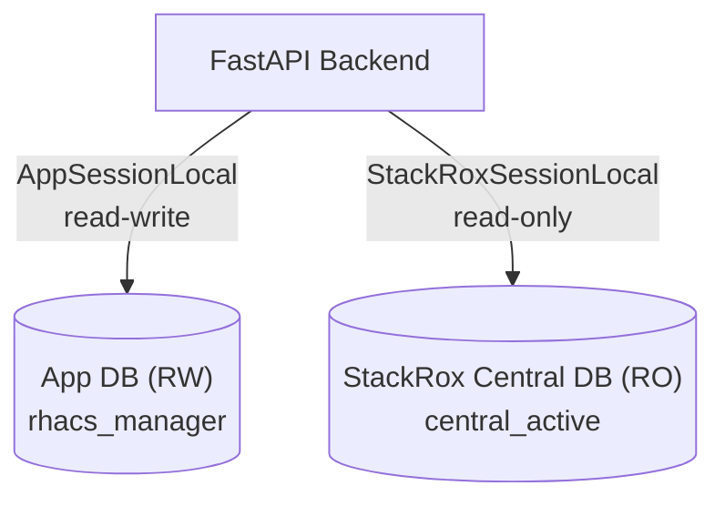
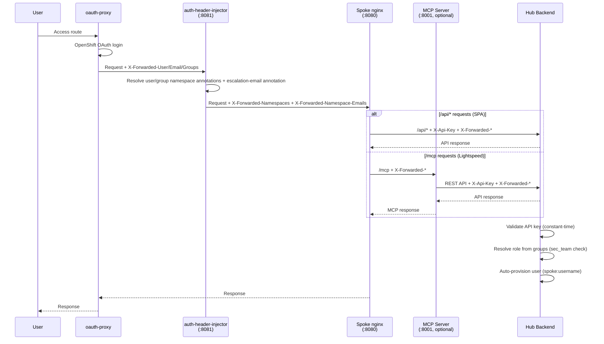

# Architecture

## Hub-Spoke Model

RHACS CVE Manager uses a hub-spoke deployment model aligned with how Red Hat Advanced Cluster Security (RHACS) operates across multiple OpenShift clusters.



**Hub cluster** runs the full stack: FastAPI backend, frontend SPA, and has access to both databases. Only administrators access the hub directly. An optional MCP server sidecar (for OpenShift Lightspeed integration) runs inside the frontend pod using a dedicated lightweight image (`rhacs-manager-mcp-server`), sharing the same oauth-proxy + auth-header-injector chain. Nginx exposes the MCP endpoint at `/mcp`.

**Spoke clusters** run a frontend pod (nginx serving the SPA) with an oauth-proxy sidecar for OpenShift OAuth and an auth-header-injector sidecar that reads K8s namespace annotations to determine user access. All API requests are proxied from the spoke nginx to the hub backend, authenticated via API key. When MCP is enabled, the MCP server runs as an additional sidecar (using the same dedicated `rhacs-manager-mcp-server` image) in the same frontend pod, ensuring namespace resolution happens on the spoke cluster where the annotations live. OpenShift Lightspeed connects to the `/mcp` endpoint on the spoke's frontend Route.

## Dual Database Design

The application maintains two separate database connections via SQLAlchemy async engines:



### App Database (read-write)

Managed by Alembic migrations. Stores all application state:

| Table | Purpose |
|-------|---------|
| `users` | User accounts (OIDC subject ID, username, email, role) |
| `risk_acceptances` | Risk acceptance requests with scope and status |
| `risk_acceptance_comments` | Discussion threads on risk acceptances |
| `cve_priorities` | Manually prioritized CVEs (set by sec team) |
| `cve_comments` | Discussion threads on individual CVEs |
| `escalations` | Triggered escalation records (CVE, namespace, cluster, level, timestamp) |
| `global_settings` | CVSS/EPSS thresholds, escalation rules, digest config |
| `notifications` | In-app notification records |
| `badge_tokens` | SVG badge token configuration |
| `audit_log` | Administrative action audit trail |

### StackRox Central Database (read-only)

Owned by RHACS. The application queries it for live CVE data. Key views and tables used:

- **`image_cves_v2`** -- primary view joining CVE data with component and fixability info
- **`deployments`** -- active deployments
- **`deployments_containers`** -- container-to-image mapping
- **`image_component_v2`** -- software components in images

```sql
-- Standard query pattern:
FROM deployments d
JOIN deployments_containers dc ON dc.deployments_id = d.id
JOIN image_cves_v2 ic ON ic.imageid = dc.image_id
LEFT JOIN image_component_v2 comp ON comp.id = ic.componentid
```

!!! warning "Always use `image_cves_v2`"
    The legacy join chain (`image_cve_edges` -> `image_cves` -> `image_component_cve_edges`) is incorrect for this schema. All queries must use the `image_cves_v2` view.

## Authentication Modes

The backend supports three authentication modes, evaluated in order:


### 1. Dev Mode

When `DEV_MODE=true`, the user is created/synced from environment variables on every request. No authentication headers are required. Namespace access is controlled via `DEV_USER_NAMESPACES` (format: `ns1:cluster1,ns2:cluster2` or `*` for all namespaces).

### 2. Spoke Proxy Mode

Activated when the request has a valid `X-Api-Key` header matching one of `SPOKE_API_KEYS`. The backend reads identity from headers injected by the oauth-proxy and auth-header-injector:

| Header | Purpose |
|--------|---------|
| `X-Forwarded-User` | Username (required) |
| `X-Forwarded-Email` | Email address |
| `X-Forwarded-Groups` | Comma-separated group list |
| `X-Forwarded-Namespaces` | Comma-separated `namespace:cluster` pairs or `*` (set by auth-header-injector) |
| `X-Forwarded-Namespace-Emails` | Comma-separated `namespace:cluster=email` pairs (set by auth-header-injector) |

If the user belongs to the group specified by `SEC_TEAM_GROUP`, they get the `sec_team` role; otherwise they are a `team_member`. Separately, users may receive wildcard namespace visibility via `X-Forwarded-Namespaces: *`. Users are auto-provisioned with ID `spoke:<username>`.

### 3. OIDC JWT

For direct hub access in production. The `Authorization: Bearer <token>` header is validated against the OIDC issuer. Users must already exist in the database.

## Spoke Auth Flow (Detailed)



## Namespace-Based Access

Namespace access is derived from Kubernetes RBAC, not from an application-managed team model. The auth-header-injector sidecar on each spoke cluster reads namespace annotations and populates forwarded headers:

- `rhacs-manager.io/users`: comma-separated usernames
- `rhacs-manager.io/groups`: comma-separated group names
- `rhacs-manager.io/escalation-email`: escalation contact email for the namespace

The auth-header-injector emits:

- `X-Forwarded-Namespaces`: `namespace:cluster` pairs or `*` for wildcard all-namespace access
- `X-Forwarded-Namespace-Emails`: `namespace:cluster=email` pairs

**`CurrentUser` carries:**

- `id`, `username`, `email`, `role` (persisted in DB)
- `namespaces: list[tuple[str, str]]` (from `X-Forwarded-Namespaces` header, NOT persisted)
- `is_sec_team` (derived from `sec_team_group` config via `X-Forwarded-Groups`)
- `has_all_namespaces` (derived from wildcard `*` access)
- `can_see_all_namespaces` (`is_sec_team or has_all_namespaces`)

`ALL_NAMESPACES_GROUPS` on the spoke injector maps one or more OpenShift groups to wildcard namespace access. This does not grant sec-team-only permissions.

## Data Model

### User Roles

| Role | Access |
|------|--------|
| `team_member` | See CVEs in their namespaces (from `X-Forwarded-Namespaces`), create risk acceptances, create badges |
| `sec_team` | See all CVEs, set priorities, review risk acceptances, configure settings |

Users with `has_all_namespaces=true` keep the `team_member` role but can query all namespaces. They still follow non-sec-team threshold filtering and cannot perform sec-team-only actions.

### CVE Visibility Logic

CVE visibility uses conjunctive threshold filtering:

1. A CVE must meet **both** `min_cvss_score` **and** `min_epss_score` thresholds to appear in non-sec views, including wildcard all-namespace users
2. **Exception**: CVEs with a manual priority or active risk acceptance always appear regardless of thresholds
3. The sec team sees all CVEs that pass the thresholds

### Risk Acceptance Scoping

Risk acceptances target specific resources via the `scope` field:

| Mode | Targets | Description |
|------|---------|-------------|
| `all` | (none) | Applies to all instances of the CVE in the user's accessible namespaces |
| `namespace` | `cluster_name`, `namespace` | Specific namespace(s) |
| `image` | `cluster_name`, `namespace`, `image_name` | Specific image(s) |
| `deployment` | `cluster_name`, `namespace`, `deployment_id` | Specific deployment(s) |

Active acceptances are unique by `(cve_id, scope_key)` where `scope_key` is a deterministic MD5 hash of the normalized scope.

### Escalation Rules

Escalation rules are stored in `global_settings.escalation_rules` as a JSON array. Each rule defines:

```json
{
    "severity_min": 4,
    "epss_threshold": 0.0,
    "days_to_level1": 7,
    "days_to_level2": 14,
    "days_to_level3": 21
}
```

The scheduler checks CVE ages against these rules and creates escalation records scoped by `(cve_id, namespace, cluster_name, level)`.

When a namespace has no `rhacs-manager.io/escalation-email` annotation, escalation delivery falls back to `DEFAULT_ESCALATION_EMAIL` if configured, then to `MANAGEMENT_EMAIL`.

## Background Jobs

APScheduler runs two recurring jobs:

| Job | Schedule | Purpose |
|-----|----------|---------|
| Escalation check | Periodic | Evaluate escalation rules against CVE ages, create namespace-scoped escalation records |
| Weekly digest | Weekly (configurable day) | Send summary email to `MANAGEMENT_EMAIL` |
