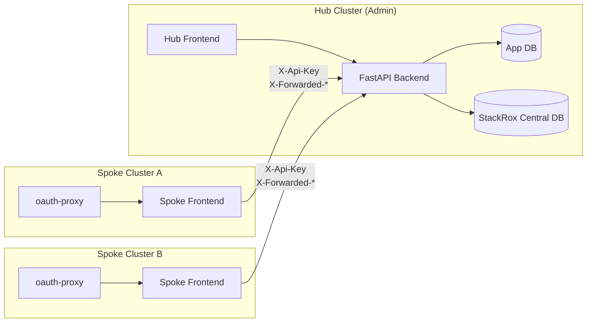
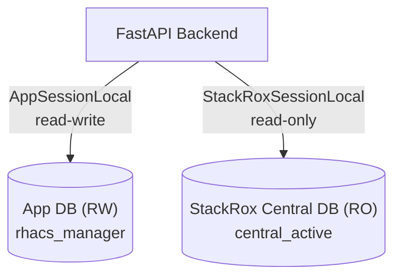
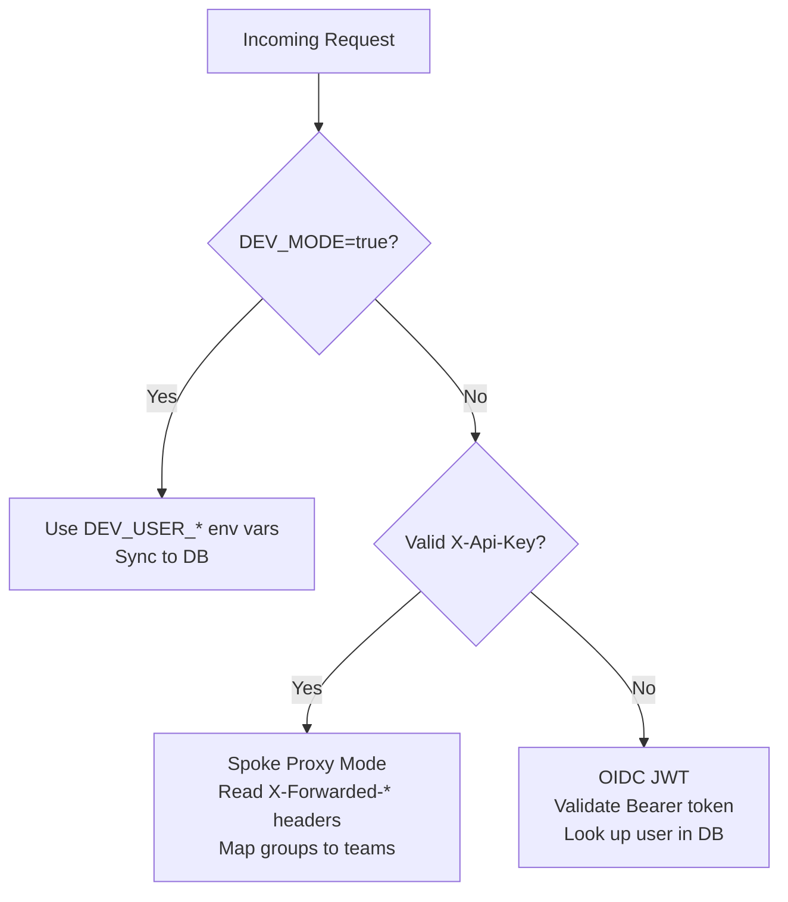
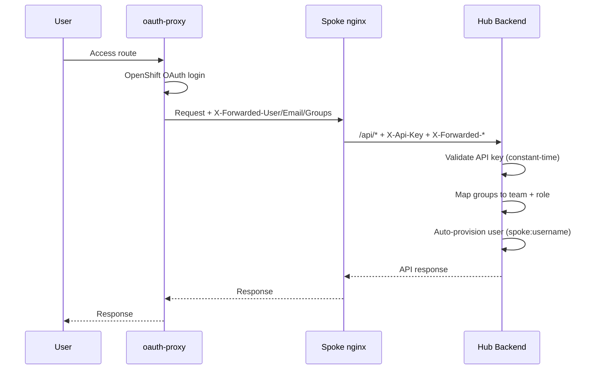

# Architecture

## Hub-Spoke Model

RHACS CVE Manager uses a hub-spoke deployment model aligned with how Red Hat Advanced Cluster Security (RHACS) operates across multiple OpenShift clusters.



**Hub cluster** runs the full stack: FastAPI backend, frontend SPA, and has access to both databases. Only administrators access the hub directly.

**Spoke clusters** run only a frontend (nginx serving the SPA) with an oauth-proxy sidecar for OpenShift OAuth. All API requests are proxied from the spoke nginx to the hub backend, authenticated via API key.

## Dual Database Design

The application maintains two separate database connections via SQLAlchemy async engines:



### App Database (read-write)

Managed by Alembic migrations. Stores all application state:

| Table | Purpose |
|-------|---------|
| `users` | User accounts (OIDC subject ID, username, email, role, team) |
| `teams` | Team definitions (name, email) |
| `team_namespaces` | Namespace-to-team mapping (namespace, cluster_name, team_id) |
| `risk_acceptances` | Risk acceptance requests with scope and status |
| `risk_acceptance_comments` | Discussion threads on risk acceptances |
| `cve_priorities` | Manually prioritized CVEs (set by sec team) |
| `cve_comments` | Discussion threads on individual CVEs |
| `escalations` | Triggered escalation records (CVE, team, level, timestamp) |
| `global_settings` | CVSS/EPSS thresholds, escalation rules, digest config |
| `notifications` | In-app notification records |
| `badge_tokens` | SVG badge token configuration |
| `audit_log` | Administrative action audit trail |

### StackRox Central Database (read-only)

Owned by RHACS. The application queries it for live CVE data. Key views and tables used:

- **`image_cves_v2`** -- primary view joining CVE data with component and fixability info
- **`deployments`** -- active deployments
- **`deployments_containers`** -- container-to-image mapping
- **`image_components`** -- software components in images

```sql
-- Standard query pattern:
FROM deployments d
JOIN deployments_containers dc ON dc.deployments_id = d.id
JOIN image_cves_v2 ic ON ic.imageid = dc.image_id
LEFT JOIN image_components comp ON comp.id = ic.componentid
```

!!! warning "Always use `image_cves_v2`"
    The legacy join chain (`image_cve_edges` -> `image_cves` -> `image_component_cve_edges`) is incorrect for this schema. All queries must use the `image_cves_v2` view.

## Authentication Modes

The backend supports three authentication modes, evaluated in order:



### 1. Dev Mode

When `DEV_MODE=true`, the user is created/synced from environment variables on every request. No authentication headers are required.

### 2. Spoke Proxy Mode

Activated when the request has a valid `X-Api-Key` header matching one of `SPOKE_API_KEYS`. The backend reads identity from headers injected by the oauth-proxy:

| Header | Purpose |
|--------|---------|
| `X-Forwarded-User` | Username (required) |
| `X-Forwarded-Email` | Email address |
| `X-Forwarded-Groups` | Comma-separated group list |

Groups are mapped to teams and roles via `GROUP_TEAM_MAPPING` and `SEC_TEAM_GROUP` settings. Users are auto-provisioned with ID `spoke:<username>`.

### 3. OIDC JWT

For direct hub access in production. The `Authorization: Bearer <token>` header is validated against the OIDC issuer. Users must already exist in the database.

## Spoke Auth Flow (Detailed)



## Data Model

### User Roles

| Role | Access |
|------|--------|
| `team_member` | See CVEs in team namespaces, create risk acceptances, create badges |
| `sec_team` | See all CVEs, set priorities, review risk acceptances, manage teams, configure settings |

### CVE Visibility Logic

CVE visibility uses conjunctive threshold filtering:

1. A CVE must meet **both** `min_cvss_score` **and** `min_epss_score` thresholds to appear in team views
2. **Exception**: CVEs with a manual priority or active risk acceptance always appear regardless of thresholds
3. The sec team sees all CVEs that pass the thresholds

### Risk Acceptance Scoping

Risk acceptances target specific resources via the `scope` field:

| Mode | Targets | Description |
|------|---------|-------------|
| `all` | (none) | Applies to all instances of the CVE in the team |
| `namespace` | `cluster_name`, `namespace` | Specific namespace(s) |
| `image` | `cluster_name`, `namespace`, `image_name` | Specific image(s) |
| `deployment` | `cluster_name`, `namespace`, `deployment_id` | Specific deployment(s) |

Active acceptances are unique by `(team_id, cve_id, scope_key)` where `scope_key` is a deterministic MD5 hash of the normalized scope.

### Escalation Rules

Escalation rules are stored in `global_settings.escalation_rules` as a JSON array. Each rule defines:

```json
{
    "severity_min": 4,
    "epss_threshold": 0.0,
    "days_to_level1": 7,
    "days_to_level2": 14,
    "days_to_level3": 21
}
```

The scheduler checks CVE ages against these rules and creates escalation records with levels 1-3.

## Background Jobs

APScheduler runs two recurring jobs:

| Job | Schedule | Purpose |
|-----|----------|---------|
| Escalation check | Periodic | Evaluate escalation rules against CVE ages, create escalation records |
| Weekly digest | Weekly (configurable day) | Send summary email to management |
