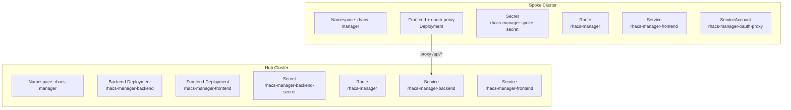

# Deployment Overview

RHACS CVE Manager uses a hub-spoke deployment model on OpenShift, managed with Kustomize or Helm.

## Deployment Topology



## What Gets Deployed Where

| Component | Hub | Spoke |
|-----------|-----|-------|
| Backend (FastAPI) | Yes | No |
| Frontend (nginx + SPA) | Yes (standard) | Yes (spoke variant with API proxy) |
| oauth-proxy sidecar | No | Yes |
| Backend secret | Yes | No |
| Spoke secret | No | Yes |
| App DB access | Yes | No |
| StackRox DB access | Yes | No |

## Kustomize Structure

```
deploy/
  base/           # Full stack (backend + frontend + services + route)
    kustomization.yaml
    namespace.yaml
    secret.yaml
    backend-deployment.yaml
    backend-service.yaml
    frontend-deployment.yaml
    frontend-service.yaml
    route.yaml
  hub/            # Hub overlay (references base as-is)
    kustomization.yaml
  spoke/          # Spoke overlay (frontend + oauth-proxy only)
    kustomization.yaml
    namespace.yaml
    spoke-secret.yaml
    frontend-deployment.yaml
    frontend-service.yaml
    oauth-proxy.yaml
    route.yaml
```

## Prerequisites

Before deploying either hub or spoke:

1. Build container images (see [Container Images](containers.md))
2. Push images to a registry accessible from the target cluster
3. Update image references in the deployment manifests
4. Edit secrets with real values (database URLs, API keys, SMTP credentials)

!!! warning "Secrets"
    The secret templates contain placeholder values. You **must** replace them before deploying. Never commit real credentials to version control.

## Applying Manifests

```bash
# Hub deployment
kubectl kustomize deploy/hub/ | kubectl apply -f -

# Spoke deployment
kubectl kustomize deploy/spoke/ | kubectl apply -f -
```

## Helm Chart (Alternative)

```bash
# Hub deployment
helm upgrade --install rhacs-manager deploy/helm/rhacs-manager \
  -n rhacs-manager --create-namespace

# Spoke deployment
helm upgrade --install rhacs-manager-spoke deploy/helm/rhacs-manager \
  -n rhacs-manager --create-namespace \
  --set mode=spoke \
  --set spoke.oauthProxy.cookieSecret='<base64-32-byte-secret>'
```
