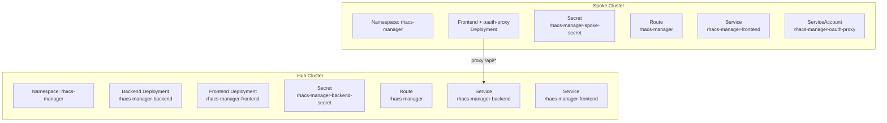

# Deployment Overview

RHACS CVE Manager uses a hub-spoke deployment model on OpenShift, managed with Helm.

## Deployment Topology



## What Gets Deployed Where

| Component              | Hub            | Spoke                              |
| ---------------------- | -------------- | ---------------------------------- |
| Backend (FastAPI)      | Yes            | No                                 |
| Frontend (nginx + SPA) | Yes (standard) | Yes (spoke variant with API proxy) |
| oauth-proxy sidecar    | No             | Yes                                |
| Backend secret         | Yes            | No                                 |
| Spoke secret           | No             | Yes                                |
| App DB access          | Yes            | No                                 |
| StackRox DB access     | Yes            | No                                 |

## Prerequisites

Before deploying either hub or spoke:

1. Build container images (see [Container Images](containers.md))
2. Push images to a registry accessible from the target cluster
3. Override image references and secret values via Helm values

!!! warning "Secrets"
The default values contain placeholder credentials. You **must** override them before deploying. Never commit real credentials to version control.

## Helm Deployment

```bash
# Hub deployment
helm upgrade --install rhacs-manager deploy/helm/rhacs-manager \
  -n rhacs-manager --create-namespace

# Spoke deployment
helm upgrade --install rhacs-manager-spoke deploy/helm/rhacs-manager \
  -n rhacs-manager --create-namespace \
  --set mode=spoke \
  --set spoke.oauthProxy.cookieSecret='<base64-32-byte-secret>'
```

See [Hub Deployment](hub.md) and [Spoke Deployment](spoke.md) for detailed configuration.

## Plain YAML (without Helm)

If you prefer plain manifests without installing Helm on the cluster, use `just` to render templates:

```bash
# Render hub manifests
just render-hub > hub.yaml
oc apply -f hub.yaml

# Render spoke manifests
just render-spoke > spoke.yaml
c oapply -f spoke.yaml
```

You can pass additional Helm flags via `just render-hub --set key=value`.
