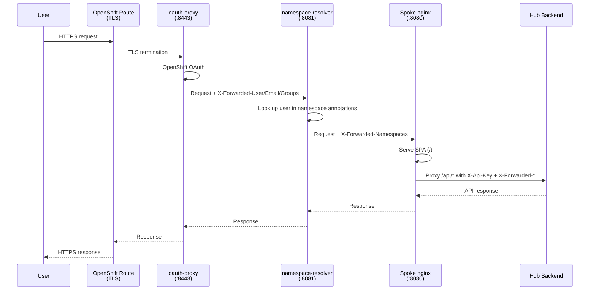

# Spoke Cluster Deployment

Spoke clusters run the frontend with an oauth-proxy sidecar and a namespace-resolver sidecar. All API requests are proxied to the hub backend. Users authenticate via OpenShift OAuth (backed by Keycloak) and never need direct hub access.

## Architecture



## Components

The spoke overlay (`deploy/spoke/kustomization.yaml`) deploys:

```yaml
resources:
  - namespace.yaml
  - spoke-secret.yaml
  - frontend-deployment.yaml
  - frontend-service.yaml
  - oauth-proxy.yaml
  - namespace-resolver-rbac.yaml
  - route.yaml
```

### Frontend Deployment

The spoke frontend deployment runs three containers in a single pod:

**1. oauth-proxy sidecar** (`quay.io/openshift/origin-oauth-proxy:4.14`):

- Listens on port 8443 (HTTPS)
- Uses OpenShift OAuth provider
- Passes user identity headers (`X-Forwarded-User/Email/Groups`) to the upstream
- Requires a TLS secret and ServiceAccount with OAuth redirect

**2. namespace-resolver sidecar** (`rhacs-manager-namespace-resolver:latest`):

- Listens on port 8081 (HTTP)
- Go sidecar sitting between oauth-proxy and nginx
- Reads `X-Forwarded-User` header, looks up K8s namespace annotations to find user's namespaces
- Sets `X-Forwarded-Namespaces` header (format: `ns1:cluster1,ns2:cluster2`)
- Caches namespace-to-user mapping (refreshed every `CACHE_TTL_SECONDS`, default 300)
- Requires ClusterRole with `list` permission on `namespaces` (see `namespace-resolver-rbac.yaml`)

**3. Spoke frontend** (`rhacs-manager-frontend-spoke:latest`):

- Listens on port 8080 (HTTP)
- Serves the React SPA
- Proxies `/api/*` requests to the hub backend
- Injects `X-Api-Key` and forwards `X-Forwarded-*` headers

### Namespace Resolver Configuration

| Variable | Default | Description |
|----------|---------|-------------|
| `CLUSTER_NAME` | _(required)_ | Name of this spoke cluster (used in namespace:cluster pairs) |
| `NAMESPACE_ANNOTATION` | `rhacs-manager.io/users` | K8s annotation key listing users with access |
| `CACHE_TTL_SECONDS` | `300` | How often to refresh the namespace cache |

**Annotation format** on Kubernetes namespaces:

```yaml
metadata:
  annotations:
    rhacs-manager.io/users: "user1,user2,user3"
```

Users listed in the annotation get access to that namespace's CVEs.

### OAuth Proxy Setup

The `oauth-proxy.yaml` creates:

- **ServiceAccount** `rhacs-manager-oauth-proxy` with OAuth redirect annotation pointing to the route
- **ClusterRoleBinding** granting `system:auth-delegator` for token validation

!!! note "TLS certificate"
    The oauth-proxy expects a TLS secret named `rhacs-manager-oauth-proxy-tls`. On OpenShift, this is typically auto-provisioned by the service-ca operator when using a service-serving certificate annotation.

### Nginx Configuration

The spoke nginx config (`frontend/nginx.conf.spoke`) handles:

1. **SPA routing** -- all unknown paths fall back to `index.html`
2. **API proxying** -- `/api/*` requests are proxied to `${HUB_API_URL}` with:
    - `X-Api-Key: ${SPOKE_API_KEY}` for hub authentication
    - Forwarded identity headers from oauth-proxy (`X-Forwarded-User`, `X-Forwarded-Email`, `X-Forwarded-Groups`, `X-Forwarded-Namespaces`)
3. **Static asset caching** -- JS, CSS, images cached for 1 year with immutable directive
4. **Gzip compression** enabled for text content types

Variables `HUB_API_URL` and `SPOKE_API_KEY` are substituted at container startup via `envsubst`.

## Configuring the Spoke Secret

Edit `deploy/spoke/spoke-secret.yaml`:

```yaml
stringData:
  HUB_API_URL: "https://rhacs-manager-api.apps.hub.example.com"
  SPOKE_API_KEY: "must-match-one-of-hub-SPOKE_API_KEYS"
  CLUSTER_NAME: "spoke-cluster-1"
```

!!! warning
    The `SPOKE_API_KEY` must exactly match one of the keys in the hub's `SPOKE_API_KEYS` list. API key validation uses constant-time comparison.

## Role Resolution

When a spoke user authenticates, their Keycloak groups (received via `X-Forwarded-Groups`) determine their role:

1. If the user belongs to the group specified by `SEC_TEAM_GROUP` (default: `rhacs-sec-team`), they get the `sec_team` role
2. Otherwise, the user is assigned the `team_member` role

Namespace access is determined entirely by K8s namespace annotations, not by group membership.

## Applying

```bash
# Build the spoke frontend image
just build-spoke-image tag=registry.example.com/rhacs-manager-spoke:latest

# Build the namespace-resolver image
podman build -t registry.example.com/rhacs-manager-namespace-resolver:latest namespace-resolver/

# Push to registry
podman push registry.example.com/rhacs-manager-spoke:latest
podman push registry.example.com/rhacs-manager-namespace-resolver:latest

# Update image references in deploy/spoke/frontend-deployment.yaml
# Apply manifests
kubectl kustomize deploy/spoke/ | kubectl apply -f -
```

## Cookie Secret

Generate a random cookie secret for oauth-proxy:

```bash
openssl rand -base64 32
```

Replace `GENERATE_A_RANDOM_32_BYTE_BASE64` in `deploy/spoke/frontend-deployment.yaml`.
