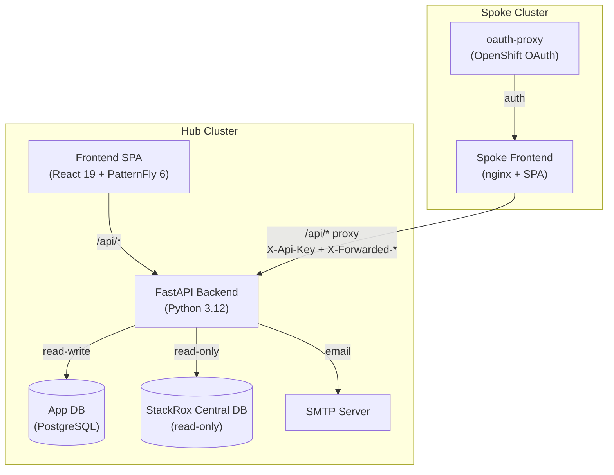
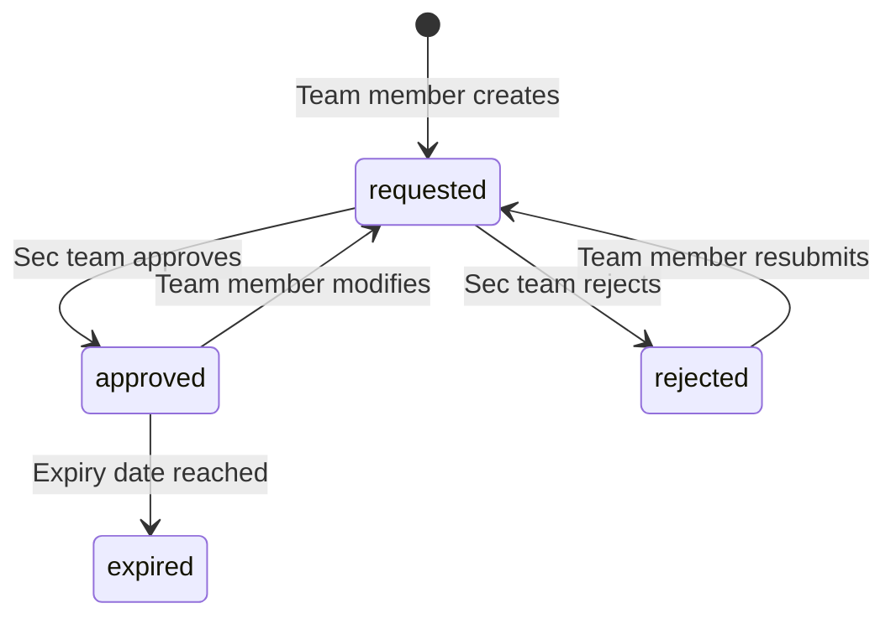

# RHACS CVE Manager

Self-service CVE management application for OpenShift RHACS (Red Hat Advanced Cluster Security). Teams manage their own CVEs with EPSS-driven prioritization; the security team has organization-wide visibility and a monitoring dashboard.

## Key Features

- **CVE listing** with EPSS-driven prioritization and CVSS/EPSS threshold filtering
- **Team-scoped namespaces** -- each team sees only CVEs affecting their deployments
- **Risk acceptance workflow** -- teams request risk acceptances, sec team reviews (requested, approved, rejected, expired)
- **Security team dashboard** -- org-wide metrics: EPSS risk matrix, cluster heatmap, team health scores, aging distribution
- **Team dashboard** -- severity distribution, CVEs per namespace, priority CVEs, high-EPSS CVEs, trend charts
- **Manual CVE prioritization** -- sec team marks CVEs as critical/high/medium/low with deadlines
- **Escalation system** -- configurable rules trigger escalations based on severity, EPSS, and age
- **Notification system** -- in-app notifications for priority changes, risk acceptance status updates, comments
- **Email notifications** -- SMTP integration for risk acceptance reviews and weekly digests
- **SVG badge generator** -- embeddable status badges for external dashboards or README files
- **Audit logging** -- all administrative actions are logged with user and timestamp
- **Hub-spoke deployment** -- hub cluster runs the backend; spoke clusters run a frontend proxy with OpenShift OAuth

## Architecture Overview

## Core Concepts

### EPSS-Driven Prioritization

The Exploit Prediction Scoring System (EPSS) probability is the primary metric for CVE triage. Combined with CVSS scores, configurable thresholds filter the CVE list to show only actionable vulnerabilities. CVEs below both thresholds are hidden from team views unless they have a manual priority or active risk acceptance.

### Dual Database Design

The application connects to two PostgreSQL databases:

| Database | Access | Purpose |
|----------|--------|---------|
| **App DB** | Read-write | Teams, users, risk acceptances, priorities, escalations, settings, audit logs |
| **StackRox Central DB** | Read-only | CVE data, deployments, images, components (managed by RHACS) |

### Team Scoping

Teams own namespaces (namespace + cluster pairs). All CVE visibility is scoped to a team's namespaces. The security team (`sec_team` role) sees all CVEs across all namespaces.

### Risk Acceptance Workflow

## Tech Stack

| Layer | Technology |
|-------|-----------|
| Frontend | React 19, TypeScript, Vite, PatternFly 6, TanStack Query 5, react-i18next |
| Backend | FastAPI, Python 3.12, SQLAlchemy 2 (async), Alembic, Pydantic v2, uv |
| Auth | OIDC JWT (hub), OpenShift OAuth + spoke proxy, dev mode bypass |
| Databases | PostgreSQL (app DB + StackRox Central DB) |
| Email | SMTP with configurable TLS |
| Scheduling | APScheduler (escalation checks, weekly digest) |
| Deploy | Kustomize, Podman/Docker, OpenShift |
