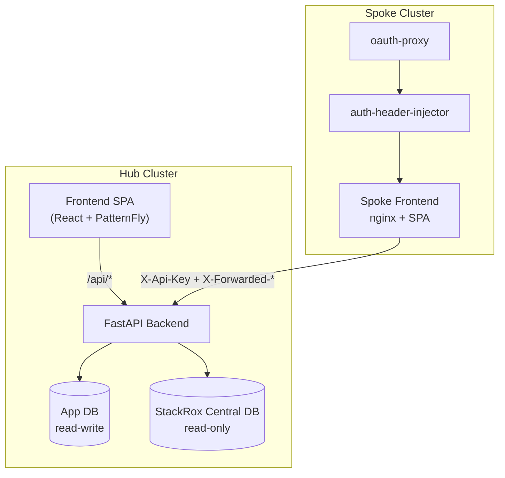

# RHACS CVE Manager

Self-service CVE management for OpenShift RHACS environments. Teams get namespace-scoped vulnerability views with a clear remediation path, while the security team gets organization-wide controls and reporting.

[Get Started :material-rocket-launch:](getting-started.md){ .md-button .md-button--primary }
[Deployment Guide :material-cloud-upload:](deployment/index.md){ .md-button }
[API Endpoints :material-api:](api/endpoints.md){ .md-button }

## Platform Highlights

- :material-shield-alert:{ .lg .middle } __EPSS-first triage__

    ---

    Prioritize by exploit probability, CVSS, and runtime impact so teams focus on likely threats first.

- :material-family-tree:{ .lg .middle } __Namespace-scoped access__

    ---

    Team visibility comes from `X-Forwarded-Namespaces` (`namespace:cluster` pairs) in spoke/hub mode.

- :material-file-sign:{ .lg .middle } __Risk acceptance workflow__

    ---

    Track requests from creation to approval/rejection/expiry with comments and audit history.

- :material-bell-badge:{ .lg .middle } __Escalations and digests__

    ---

    Rule-driven escalation levels and weekly summaries keep unresolved risk visible.

- :material-chart-areaspline:{ .lg .middle } __Operational dashboards__

    ---

    Severity, EPSS matrix, cluster heatmap, trend, aging, and risk pipeline in one place.

- :material-tag-outline:{ .lg .middle } __Public SVG badges__

    ---

    Create namespace badges for dashboards and status pages without exposing API access.

## Architecture Snapshot

## RHACS Compatibility

| RHACS Version | Status |
| --- | --- |
| 4.10.x | Tested |

RHACS Manager reads directly from the StackRox Central database. Schema changes in future RHACS versions may require updates to the queries in this project. If you encounter issues with a newer RHACS version, please open an issue.

## Core Design Rules

- CVE visibility for non-sec users is namespace-scoped.
- Threshold filtering is conjunctive (`min_cvss_score` and `min_epss_score`).
- Prioritized CVEs and CVEs with active risk acceptances bypass threshold filtering.
- `image_cves_v2` is the authoritative StackRox source for CVE data.

## Documentation Map

- [Getting Started](getting-started.md): local setup, migration, and developer workflow
- [Architecture](architecture.md): trust boundaries, auth modes, and data flow
- [Configuration](configuration.md): all environment variables and runtime settings
- [Deployment](deployment/index.md): hub and spoke deployment on OpenShift
- [API](api/index.md): contracts and endpoint behavior
