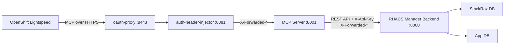

# MCP Server

RHACS Manager includes an optional [Model Context Protocol (MCP)](https://modelcontextprotocol.io/) server that exposes CVE management capabilities as tools for AI assistants like **OpenShift Lightspeed**.

## Overview

The MCP server is a thin HTTP proxy that translates MCP tool calls into RHACS Manager API requests. It runs behind the same `oauth-proxy → auth-header-injector` sidecar chain used by the frontend, so all existing authentication, authorization, and namespace scoping rules apply identically.



The auth-header-injector resolves the user's namespace scope from Kubernetes namespace annotations and injects `X-Forwarded-Namespaces` headers. The MCP server forwards these headers (along with an `X-Api-Key`) to the backend, which uses the spoke proxy auth path.

## Configuration

The MCP server is configured via environment variables:

| Variable | Default | Description |
|----------|---------|-------------|
| `MCP_BACKEND_URL` | `http://localhost:8000` | URL of the RHACS Manager backend API |
| `MCP_PORT` | `8001` | Port the MCP server listens on |
| `MCP_READONLY` | `false` | When `true`, only read-only tools are exposed |
| `MCP_API_KEY` | (empty) | Shared secret for backend spoke proxy auth |

## Available Tools

### Read-only tools (always available)

| Tool | Description |
|------|-------------|
| `get_security_overview` | Dashboard summary: severity distribution, trends, MTTR, top EPSS CVEs |
| `search_cves` | Search/filter CVEs by keyword, severity, fixability, namespace, cluster |
| `get_cve_detail` | Full CVE detail with scores, components, timeline, and links |
| `get_cve_affected_deployments` | List deployments affected by a specific CVE |
| `list_risk_acceptances` | List risk acceptances filtered by status or CVE |
| `list_remediations` | List remediation records filtered by status, CVE, or namespace |
| `get_my_info` | Current user identity, role, and visible namespaces |

### Write tools (disabled in readonly mode)

| Tool | Description |
|------|-------------|
| `create_risk_acceptance` | Create a risk acceptance for a CVE with justification and scope |
| `create_remediation` | Start tracking remediation for a CVE in a namespace/cluster |
| `update_remediation_status` | Progress a remediation through its workflow |

## Local Development

Start the backend and MCP server together:

```bash
# Terminal 1: start the backend
just dev

# Terminal 2: start the MCP server
just dev-mcp

# Or in readonly mode
just dev-mcp-readonly
```

The MCP server will be available at `http://localhost:8001/mcp`.

## Helm Deployment

The MCP server is deployed as a 3-container pod (oauth-proxy, auth-header-injector, mcp-server) alongside the backend, following the same pattern as the frontend. Enable it in your values:

```yaml
mcp:
  enabled: true
  readonly: false  # set to true for read-only mode
  oauthProxy:
    cookieSecret: "<generate-a-random-secret>"
  secret:
    name: rhacs-manager-mcp  # must contain MCP_API_KEY and CLUSTER_NAME
```

The MCP server uses the same backend container image with a different entrypoint. The oauth-proxy handles OpenShift OAuth, the auth-header-injector resolves namespace scope from Kubernetes annotations, and the MCP server forwards these headers to the backend via `X-Api-Key` + `X-Forwarded-*` headers.

The `MCP_API_KEY` must match one of the `SPOKE_API_KEYS` configured on the backend.

### Example

```bash
helm upgrade --install rhacs-manager deploy/helm/rhacs-manager \
  -n rhacs-manager \
  --set mcp.enabled=true \
  --set mcp.readonly=true \
  --set mcp.oauthProxy.cookieSecret="$(openssl rand -base64 32)"
```

## OpenShift Lightspeed Integration

Once the MCP server is deployed, configure OpenShift Lightspeed to connect to it.

### Expose the MCP server

Enable the OpenShift Route so Lightspeed can reach the MCP endpoint:

```yaml
mcp:
  enabled: true
  route:
    enabled: true
    host: rhacs-manager-mcp.apps.example.com
```

The route terminates TLS via `reencrypt` (the oauth-proxy serves its own TLS on port 8443). Alternatively, use the in-cluster service URL directly: `https://rhacs-manager-mcp.rhacs-manager.svc:8443/mcp`

### Configure OLSConfig

Add the MCP server to the OpenShift Lightspeed Operator configuration. No special headers are needed — the oauth-proxy handles authentication via OpenShift OAuth, and the auth-header-injector resolves namespace scope automatically.

```yaml
apiVersion: ols.openshift.io/v1alpha1
kind: OLSConfig
metadata:
  name: cluster
spec:
  ols:
    mcpServers:
      - name: rhacs-manager
        url: https://rhacs-manager-mcp.apps.example.com/mcp
```

The oauth-proxy authenticates the user via OpenShift OAuth, the auth-header-injector resolves their namespace scope from Kubernetes namespace annotations, and the MCP server forwards these identity headers to the backend. The user's OpenShift identity determines which namespaces and actions are available.

## Readonly Mode

When `MCP_READONLY=true`, write tools (`create_risk_acceptance`, `create_remediation`, `update_remediation_status`) are not registered. They will not appear in the tool list, preventing the AI assistant from attempting any mutations.

This is recommended for initial rollouts or environments where AI-driven changes are not yet approved.
