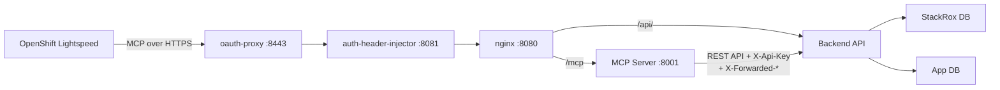

# MCP Server

RHACS Manager includes an optional [Model Context Protocol (MCP)](https://modelcontextprotocol.io/) server that exposes CVE management capabilities as tools for AI assistants like **OpenShift Lightspeed**.

## Overview

The MCP server runs as an additional sidecar container in the frontend pod, reusing the existing `oauth-proxy → auth-header-injector` authentication chain. Nginx exposes a `/mcp` endpoint that proxies to the local MCP server, which translates MCP tool calls into RHACS Manager backend API requests.

This architecture ensures namespace resolution always happens on the cluster where the namespaces live — critical for spoke deployments where namespace annotations are local to the spoke.



The auth-header-injector resolves the user's namespace scope from Kubernetes namespace annotations and injects `X-Forwarded-Namespaces` headers. Nginx forwards these to the MCP server, which then includes them (along with an `X-Api-Key`) when calling the backend.

## Configuration

The MCP server is configured via environment variables:

| Variable          | Default                 | Description                                   |
| ----------------- | ----------------------- | --------------------------------------------- |
| `MCP_BACKEND_URL` | `http://localhost:8000` | URL of the RHACS Manager backend API          |
| `MCP_PORT`        | `8001`                  | Port the MCP server listens on                |
| `MCP_READONLY`    | `false`                 | When `true`, only read-only tools are exposed |
| `MCP_API_KEY`     | (empty)                 | Shared secret for backend spoke proxy auth    |

## Available Tools

### Read-only tools (always available)

| Tool                           | Description                                                             |
| ------------------------------ | ----------------------------------------------------------------------- |
| `get_security_overview`        | Dashboard summary: severity distribution, trends, MTTR, top EPSS CVEs   |
| `search_cves`                  | Search/filter CVEs by keyword, severity, fixability, namespace, cluster |
| `get_cve_detail`               | Full CVE detail with scores, components, timeline, and links            |
| `get_cve_affected_deployments` | List deployments affected by a specific CVE                             |
| `list_risk_acceptances`        | List risk acceptances filtered by status or CVE                         |
| `list_remediations`            | List remediation records filtered by status, CVE, or namespace          |
| `get_my_info`                  | Current user identity, role, and visible namespaces                     |

### Write tools (disabled in readonly mode)

| Tool                        | Description                                                     |
| --------------------------- | --------------------------------------------------------------- |
| `create_risk_acceptance`    | Create a risk acceptance for a CVE with justification and scope |
| `create_remediation`        | Start tracking remediation for a CVE in a namespace/cluster     |
| `update_remediation_status` | Progress a remediation through its workflow                     |

## Local Development

Start the backend and MCP server together:

```bash
# Terminal 1: start the backend
just dev

# Terminal 2: start the MCP server
just dev-mcp

# Or in readonly mode
just dev-mcp-readonly
```

The MCP server will be available at `http://localhost:8001/mcp`.

## Helm Deployment

The MCP server runs as a sidecar container in the frontend pod using its own dedicated lightweight image (`rhacs-manager-mcp-server`). When enabled, the frontend pod grows from 3 containers (oauth-proxy, auth-header-injector, nginx) to 4 (adding mcp-server). The MCP endpoint is exposed at `/mcp` on the existing frontend Route — no additional Services or Routes are needed.

### Hub Mode

```yaml
mcp:
  enabled: true
  readonly: false # set to true for read-only mode
  secret:
    name: rhacs-manager-mcp # must contain MCP_API_KEY
```

The `MCP_API_KEY` must match one of the `SPOKE_API_KEYS` configured on the backend. The MCP server calls the backend directly via the in-cluster service URL.

### Spoke Mode

```yaml
spoke:
  mcp:
    enabled: true
    readonly: true
```

In spoke mode, the MCP server uses the same `HUB_API_URL` and `SPOKE_API_KEY` from the spoke secret to reach the hub backend — identical to how the spoke frontend proxies `/api/` requests.

### Example

```bash
# Hub deployment with MCP enabled
helm upgrade --install rhacs-manager deploy/helm/rhacs-manager \
  -n rhacs-manager \
  --set mcp.enabled=true \
  --set mcp.readonly=true

# Spoke deployment with MCP enabled
helm upgrade --install rhacs-manager deploy/helm/rhacs-manager \
  -n rhacs-manager \
  --set mode=spoke \
  --set spoke.mcp.enabled=true
```

## OpenShift Lightspeed Integration

Once the MCP server is enabled, configure OpenShift Lightspeed to connect to the `/mcp` endpoint on the frontend service using the cluster-internal FQDN.

### Prerequisites

The frontend service uses a serving certificate issued by the OpenShift service CA. To let OLS trust this certificate, create a ConfigMap with the `service.beta.openshift.io/inject-cabundle` annotation in the `openshift-lightspeed` namespace:

```yaml
apiVersion: v1
kind: ConfigMap
metadata:
  name: rhacs-manager-serving-ca
  namespace: openshift-lightspeed
  annotations:
    service.beta.openshift.io/inject-cabundle: "true"
data: {}
```

### Configure OLSConfig

```yaml
apiVersion: ols.openshift.io/v1alpha1
kind: OLSConfig
metadata:
  name: cluster
spec:
  featureGates:
    - MCPServer
  ols:
    additionalCAConfigMapRef:
      name: rhacs-manager-serving-ca
  mcpServers:
    - name: rhacs-manager
      url: https://rhacs-manager-frontend.rhacs-manager.svc:8443/mcp
      headers:
        - name: Authorization
          valueFrom:
            type: kubernetes
```

The oauth-proxy authenticates the user via OpenShift OAuth, the auth-header-injector resolves their namespace scope from Kubernetes namespace annotations on the local cluster, and the MCP server forwards these identity headers to the backend. The user's OpenShift identity determines which namespaces and actions are available.

## Plain HTTP

By default the MCP endpoint is only reachable through the oauth-proxy HTTPS port (8443). If you need a plain HTTP port — for example when TLS is terminated at an external load balancer or ingress — enable `plainHttp`:

```yaml
# Hub
mcp:
  enabled: true
  plainHttp:
    enabled: true
    port: 8082  # default

# Spoke
spoke:
  mcp:
    enabled: true
    plainHttp:
      enabled: true
      port: 8082  # default
```

Traffic on the plain HTTP port still flows through the full oauth-proxy authentication chain, so `X-Forwarded-*` headers are set correctly. The only difference is that TLS is not used on the Service port itself.

Enabling `plainHttp` also configures `--openshift-delegate-urls` on oauth-proxy, which allows bearer token authentication (required for service-to-service clients like OpenShift Lightspeed). The oauth-proxy service account must have permission to perform SubjectAccessReviews.

When using plain HTTP with OLS, the `additionalCAConfigMapRef` is no longer needed:

```yaml
mcpServers:
  - name: rhacs-manager
    url: http://rhacs-manager-frontend.rhacs-manager.svc:8082/mcp
    headers:
      - name: Authorization
        valueFrom:
          type: kubernetes
```

## Readonly Mode

When `MCP_READONLY=true`, write tools (`create_risk_acceptance`, `create_remediation`, `update_remediation_status`) are not registered. They will not appear in the tool list, preventing the AI assistant from attempting any mutations.

This is recommended for initial rollouts or environments where AI-driven changes are not yet approved.
