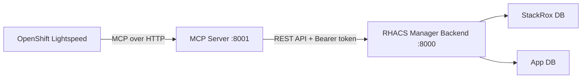

# MCP Server

RHACS Manager includes an optional [Model Context Protocol (MCP)](https://modelcontextprotocol.io/) server that exposes CVE management capabilities as tools for AI assistants like **OpenShift Lightspeed**.

## Overview

The MCP server is a thin HTTP proxy that translates MCP tool calls into RHACS Manager API requests. It forwards the user's Bearer token to the backend, so all existing authentication, authorization, and namespace scoping rules apply.



## Configuration

The MCP server is configured via environment variables:

| Variable | Default | Description |
|----------|---------|-------------|
| `MCP_BACKEND_URL` | `http://localhost:8000` | URL of the RHACS Manager backend API |
| `MCP_PORT` | `8001` | Port the MCP server listens on |
| `MCP_READONLY` | `false` | When `true`, only read-only tools are exposed |

## Available Tools

### Read-only tools (always available)

| Tool | Description |
|------|-------------|
| `get_security_overview` | Dashboard summary: severity distribution, trends, MTTR, top EPSS CVEs |
| `search_cves` | Search/filter CVEs by keyword, severity, fixability, namespace, cluster |
| `get_cve_detail` | Full CVE detail with scores, components, timeline, and links |
| `get_cve_affected_deployments` | List deployments affected by a specific CVE |
| `list_risk_acceptances` | List risk acceptances filtered by status or CVE |
| `list_remediations` | List remediation records filtered by status, CVE, or namespace |
| `get_my_info` | Current user identity, role, and visible namespaces |

### Write tools (disabled in readonly mode)

| Tool | Description |
|------|-------------|
| `create_risk_acceptance` | Create a risk acceptance for a CVE with justification and scope |
| `create_remediation` | Start tracking remediation for a CVE in a namespace/cluster |
| `update_remediation_status` | Progress a remediation through its workflow |

## Local Development

Start the backend and MCP server together:

```bash
# Terminal 1: start the backend
just dev

# Terminal 2: start the MCP server
just dev-mcp

# Or in readonly mode
just dev-mcp-readonly
```

The MCP server will be available at `http://localhost:8001/mcp`.

## Helm Deployment

The MCP server is deployed as a separate pod alongside the backend. Enable it in your values:

```yaml
mcp:
  enabled: true
  readonly: false  # set to true for read-only mode
```

The MCP server uses the same backend container image with a different entrypoint. It connects to the backend via its internal ClusterIP service.

### Example

```bash
helm upgrade --install rhacs-manager deploy/helm/rhacs-manager \
  -n rhacs-manager \
  --set mcp.enabled=true \
  --set mcp.readonly=true
```

## OpenShift Lightspeed Integration

Once the MCP server is deployed, configure OpenShift Lightspeed to connect to it.

### Expose the MCP server

Enable the OpenShift Route so Lightspeed can reach the MCP endpoint:

```yaml
mcp:
  enabled: true
  route:
    enabled: true
    host: rhacs-manager-mcp.apps.example.com
```

Alternatively, use the in-cluster service URL directly: `http://rhacs-manager-mcp.rhacs-manager.svc:8001/mcp`

### Configure OLSConfig

Add the MCP server to the OpenShift Lightspeed Operator configuration. The special `kubernetes` placeholder for the `Authorization` header tells Lightspeed to automatically inject the authenticated user's Kubernetes token into each MCP request. This requires the `k8s` authentication module to be active in OLS.

```yaml
apiVersion: ols.openshift.io/v1alpha1
kind: OLSConfig
metadata:
  name: cluster
spec:
  ols:
    mcpServers:
      - name: rhacs-manager
        url: https://rhacs-manager-mcp.apps.example.com/mcp
        headers:
          - name: Authorization
            valueFrom:
              type: kubernetes
```

The MCP server forwards the token to the RHACS Manager backend, where the existing auth middleware handles all authentication and authorization. The user's token determines which namespaces and actions are available.

## Readonly Mode

When `MCP_READONLY=true`, write tools (`create_risk_acceptance`, `create_remediation`, `update_remediation_status`) are not registered. They will not appear in the tool list, preventing the AI assistant from attempting any mutations.

This is recommended for initial rollouts or environments where AI-driven changes are not yet approved.
