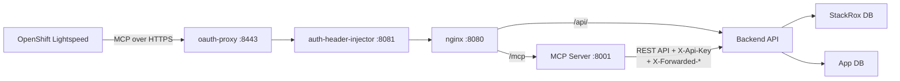

# MCP Server

RHACS Manager includes an optional [Model Context Protocol (MCP)](https://modelcontextprotocol.io/) server that exposes CVE management capabilities as tools for AI assistants like **OpenShift Lightspeed**.

## Overview

The MCP server runs as an additional sidecar container in the frontend pod, reusing the existing `oauth-proxy → auth-header-injector` authentication chain. Nginx exposes a `/mcp` endpoint that proxies to the local MCP server, which translates MCP tool calls into RHACS Manager backend API requests.

This architecture ensures namespace resolution always happens on the cluster where the namespaces live — critical for spoke deployments where namespace annotations are local to the spoke.


```mermaid
graph LR
    A[OpenShift Lightspeed] -->|MCP over HTTPS| B[oauth-proxy :8443]
    B --> C[auth-header-injector :8081]
    C --> D[nginx :8080]
    D -->|"/mcp"| E[MCP Server :8001]
    D -->|"/api/"| F[Backend API]
    E -->|"REST API + X-Api-Key<br/>+ X-Forwarded-*"| F
    F --> G[StackRox DB]
    F --> H[App DB]
```

The auth-header-injector resolves the user's namespace scope from Kubernetes namespace annotations and injects `X-Forwarded-Namespaces` headers. Nginx forwards these to the MCP server, which then includes them (along with an `X-Api-Key`) when calling the backend.

The MCP server runs streamable HTTP in **stateless mode** (`stateless_http=True`): every request is self-contained and derives its auth context from the forwarded headers, with no in-memory session keyed by `Mcp-Session-Id`. This is required because the frontend pod runs with multiple replicas behind a Service without session affinity — consecutive MCP requests may land on different pods.

## Configuration

The MCP server is configured via environment variables:

| Variable          | Default                                                    | Description                                                                                                                                                                                |
| ----------------- | ---------------------------------------------------------- | ------------------------------------------------------------------------------------------------------------------------------------------------------------------------------------------ |
| `MCP_BACKEND_URL` | `http://localhost:8000`                                    | URL of the RHACS Manager backend API.                                                                                                                                                      |
| `MCP_PORT`        | `8001`                                                     | Port the MCP server listens on.                                                                                                                                                            |
| `MCP_READONLY`    | `false`                                                    | When `true`, only read-only tools are exposed.                                                                                                                                             |
| `MCP_API_KEY`     | (empty)                                                    | Shared secret for backend spoke proxy auth.                                                                                                                                                |
| `MCP_CA_BUNDLE`   | `/var/run/secrets/kubernetes.io/serviceaccount/ca.crt`     | Path to a CA bundle for TLS verification when calling the backend. Set to `false` to disable verification, or empty to use system defaults. Missing files fall back to default verification. |
| `MCP_LOG_LEVEL`   | `info`                                                     | Python logging level (`debug`, `info`, `warning`, `error`, `critical`).                                                                                                                    |
| `SSL_CERT_FILE`   | (empty)                                                    | Standard OpenSSL variable. When set, this file becomes the base trust store of the SSL context, and the `MCP_CA_BUNDLE` CA is added on top. The Helm chart points it at the injected cluster trusted CA bundle. |

## Available Tools

### Read-only tools (always available)

| Tool                           | Description                                                                                                                                                       |
| ------------------------------ | ----------------------------------------------------------------------------------------------------------------------------------------------------------------- |
| `get_security_overview`        | Dashboard summary: headline stats (`stat_*`, including `stat_fix_overdue_cves`), severity distribution, top priority and high-EPSS CVEs, fixability, aging buckets, and risk-acceptance pipeline counts. Chart-only series (CVE/fixability trend, EPSS scatter, cluster heatmap, MTTR breakdown) are stripped to keep the payload compact. |
| `search_cves`                  | Search and filter CVEs across visible namespaces. Supports `search`, `severity`, `fixable`, `namespace`, `cluster`, `component`, `deployment`, `cvss_min`, `epss_min`, `age_min/age_max`, `prioritized_only`, `risk_status`, `remediation_status`, `fix_overdue` (RHACS 4.10), and pagination. Results include `fix_available_since`. |
| `get_cves_by_image`            | List container images grouped by CVE burden — totals, severity breakdown, max CVSS/EPSS, fixable counts, affected deployments, namespaces, clusters. Filterable by cluster, namespace, severity, fixability, CVSS floor, component, or image name. |
| `get_cve_detail`               | Full CVE detail with scores, components, the affected deployments (`affected_deployments_list` — the blast radius, with per-deployment risk-acceptance/remediation/suppression flags), timeline, Red Hat / NVD links, and risk-acceptance status. Includes the RHACS 4.10 fields `fix_available_since` and (for sec-team callers) `first_system_occurrence`. |
| `get_image_layers`             | Containerfile (Dockerfile) layer instructions for an image plus metadata and CVE summary. Useful after `get_cve_detail` to identify which layer introduced a vulnerable component. |
| `list_risk_acceptances`        | List risk acceptances filtered by status (`requested`, `approved`, `rejected`, `expired`) or CVE.                                                                 |
| `list_remediations`            | List remediation records filtered by status (`open`, `in_progress`, `resolved`, `verified`, `wont_fix`), CVE, or namespace.                                       |
| `get_escalations`              | List escalations for visible CVEs. Default (`upcoming=false`) returns escalations already triggered (level, namespace, cluster, triggered timestamp, notification state); `upcoming=true` returns CVEs approaching escalation deadlines. Rules can be anchored on `first_seen` or, for RHACS 4.10, on `fix_available_since`. |
| `get_settings`                 | Current global settings. Sec-team callers get the full payload (thresholds, escalation rules with the RHACS 4.10 `days_to_levelN_after_fix_available` anchors, `fix_overdue_threshold_days`, digest schedule, management email); other callers fall back to public thresholds. |
| `get_my_info`                  | Current user identity, role, and visible namespaces.                                                                                                              |

### Write tools (disabled in readonly mode)

| Tool                        | Description                                                                                                                                                  |
| --------------------------- | ------------------------------------------------------------------------------------------------------------------------------------------------------------ |
| `create_risk_acceptance`    | Document that a **real** vulnerability is consciously accepted without an immediate fix, with justification and scope (`all`, `namespace`, `image`, or `deployment`). Single-namespace scopes auto-approve; `all`/multi-namespace scopes go to sec-team review. |
| `request_cve_suppression`   | Request suppression of a CVE that is a **false positive or not applicable** (finding is wrong/irrelevant), with a reason and scope (`all` or `namespace`). Team-member requests await sec-team review; sec-team callers approve directly. Use this instead of `create_risk_acceptance` when the vulnerability does not actually apply. |
| `create_remediation`        | Start tracking remediation for a CVE in a namespace/cluster.                                                                                                 |
| `update_remediation_status` | Progress a remediation through its workflow (`open`, `in_progress`, `resolved`, `wont_fix`). `resolved` is terminal (reopen to `in_progress` only) and there is no verification step. `wont_fix` requires a reason. (`verified` is accepted only as a legacy filter value, not a settable target.) |

## Prompts

The MCP server also registers named workflow prompts. Prompts are templates that seed the conversation with the right tool sequence — they don't call the backend themselves; the LLM drives the tool invocations once the prompt is resolved. They are available in both readonly and read-write mode.

| Prompt                    | Arguments              | Workflow                                                                                                                                                                |
| ------------------------- | ---------------------- | ----------------------------------------------------------------------------------------------------------------------------------------------------------------------- |
| `triage_namespace`        | `namespace`, `cluster?` | Walks through prioritized CVEs → fix-overdue CVEs → upcoming escalations → in-flight remediations for one namespace, then summarises the next concrete actions.        |
| `investigate_cve`         | `cve_id`               | Deep-dive on a single CVE: detail (including the affected-deployments blast radius) → image layer that introduced the component → existing risk acceptances and remediations → recommended next action.   |
| `weekly_security_review`  | (none)                 | Compiles a weekly status report: security overview → upcoming escalations → pending risk-acceptance reviews → remediation work in flight.                              |

## Local Development

Start the backend and MCP server together:

```bash
# Terminal 1: start the backend
just dev

# Terminal 2: start the MCP server
just dev-mcp

# Or in readonly mode
just dev-mcp-readonly
```

The MCP server will be available at `http://localhost:8001/mcp`.

## Helm Deployment

The MCP server runs as a sidecar container in the frontend pod using its own dedicated lightweight image (`rhacs-manager-mcp-server`). When enabled, the frontend pod grows from 3 containers (oauth-proxy, auth-header-injector, nginx) to 4 (adding mcp-server). The MCP endpoint is exposed at `/mcp` on the existing frontend Route — no additional Services or Routes are needed.

### Hub Mode

```yaml
mcp:
  enabled: true
  readonly: false # set to true for read-only mode
  secret:
    create: true # chart creates the secret from stringData below
    name: rhacs-manager-mcp
    stringData:
      MCP_API_KEY: "<key matching a backend SPOKE_API_KEYS entry>"
```

The `MCP_API_KEY` must match one of the `SPOKE_API_KEYS` configured on the backend. The MCP server calls the backend directly via the in-cluster service URL.

By default (`secret.create: true`) the chart creates the `rhacs-manager-mcp` secret for you, and an empty `MCP_API_KEY` fails the install with a clear error. To manage the secret yourself, set `secret.create: false` and pre-create a secret named `rhacs-manager-mcp` containing an `MCP_API_KEY` key.

### Spoke Mode

```yaml
spoke:
  mcp:
    enabled: true
    readonly: true
```

In spoke mode, the MCP server uses the same `HUB_API_URL` and `SPOKE_API_KEY` from the spoke secret to reach the hub backend — identical to how the spoke frontend proxies `/api/` requests.

### Cluster Trusted CA Bundle

The hub route certificate is typically signed by the cluster's ingress or enterprise CA, not by the OpenShift service CA. To make TLS verification against the hub work out of the box, the chart creates a ConfigMap labeled `config.openshift.io/inject-trusted-cabundle: "true"` (`rhacs-manager-mcp-trusted-cabundle`). The Cluster Network Operator injects the cluster-wide trusted CA bundle (system roots plus any proxy `additionalTrustBundle`) into it, and the chart mounts it into the MCP server container with `SSL_CERT_FILE` pointing at it.

The MCP server's resulting trust store is the cluster trusted CA bundle plus the service CA from `MCP_CA_BUNDLE`. On non-OpenShift clusters the ConfigMap stays empty and the mount is harmless.

### Example

```bash
# Hub deployment with MCP enabled
helm upgrade --install rhacs-manager deploy/helm/rhacs-manager \
  -n rhacs-manager \
  --set mcp.enabled=true \
  --set mcp.readonly=true \
  --set mcp.secret.stringData.MCP_API_KEY=<key-matching-a-backend-SPOKE_API_KEYS-entry>

# Spoke deployment with MCP enabled
helm upgrade --install rhacs-manager deploy/helm/rhacs-manager \
  -n rhacs-manager \
  --set mode=spoke \
  --set spoke.mcp.enabled=true
```

## OpenShift Lightspeed Integration

Once the MCP server is enabled, configure OpenShift Lightspeed to connect to the `/mcp` endpoint on the frontend service using the cluster-internal FQDN.

### Prerequisites

The frontend service uses a serving certificate issued by the OpenShift service CA. To let OLS trust this certificate, create a ConfigMap with the `service.beta.openshift.io/inject-cabundle` annotation in the `openshift-lightspeed` namespace:

```yaml
apiVersion: v1
kind: ConfigMap
metadata:
  name: rhacs-manager-serving-ca
  namespace: openshift-lightspeed
  annotations:
    service.beta.openshift.io/inject-cabundle: "true"
data: {}
```

### Configure OLSConfig

```yaml
apiVersion: ols.openshift.io/v1alpha1
kind: OLSConfig
metadata:
  name: cluster
spec:
  featureGates:
    - MCPServer
  ols:
    additionalCAConfigMapRef:
      name: rhacs-manager-serving-ca
  mcpServers:
    - name: rhacs-manager
      url: https://rhacs-manager-frontend.rhacs-manager.svc:8443/mcp
      headers:
        - name: Authorization
          valueFrom:
            type: kubernetes
```

The oauth-proxy authenticates the user via OpenShift OAuth, the auth-header-injector resolves their namespace scope from Kubernetes namespace annotations on the local cluster, and the MCP server forwards these identity headers to the backend. The user's OpenShift identity determines which namespaces and actions are available.

## Plain HTTP

By default the MCP endpoint is only reachable through the oauth-proxy HTTPS port (8443). If you need a plain HTTP port — for example when TLS is terminated at an external load balancer or ingress — enable `plainHttp`:

```yaml
# Hub
mcp:
  enabled: true
  plainHttp:
    enabled: true
    port: 8082  # default

# Spoke
spoke:
  mcp:
    enabled: true
    plainHttp:
      enabled: true
      port: 8082  # default
```

Traffic on the plain HTTP port still flows through the full oauth-proxy authentication chain, so `X-Forwarded-*` headers are set correctly. The only difference is that TLS is not used on the Service port itself.

Enabling `plainHttp` also configures `--openshift-delegate-urls` on oauth-proxy, which allows bearer token authentication in addition to the cookie-based OAuth flow. This is required for service-to-service clients like OpenShift Lightspeed, which forward the end user's bearer token with each request. The delegate URL performs a SubjectAccessReview checking that the user can create `selfsubjectaccessreviews` — a permission every authenticated OpenShift user has by default.

When using plain HTTP with OLS, the `additionalCAConfigMapRef` is no longer needed:

```yaml
mcpServers:
  - name: rhacs-manager
    url: http://rhacs-manager-frontend.rhacs-manager.svc:8082/mcp
    headers:
      - name: Authorization
        valueFrom:
          type: kubernetes
```

## Readonly Mode

When `MCP_READONLY=true`, write tools (`create_risk_acceptance`, `request_cve_suppression`, `create_remediation`, `update_remediation_status`) are not registered. They will not appear in the tool list, preventing the AI assistant from attempting any mutations. Read-only tools and prompts remain available.

This is recommended for initial rollouts or environments where AI-driven changes are not yet approved.
