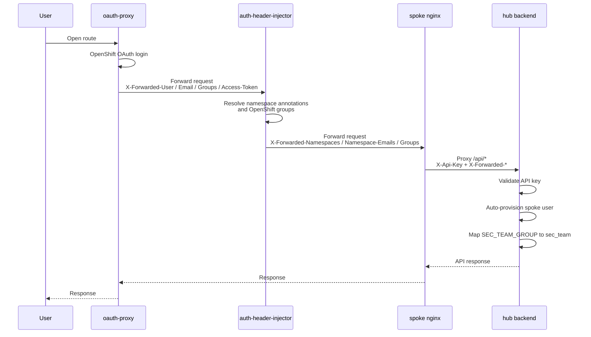

# Security Model

RHACS CVE Manager uses OpenShift-authenticated spoke frontends plus a hub backend. Authorization is driven by namespace annotations and group membership, not by an application-managed team table.

See [Deployment](deployment/spoke.md) for spoke setup details and [User Guide](user-guide.md) for the operational workflows that sit on top of this model.

## Authentication Flow



## RBAC Source of Truth

Namespace access is derived from Kubernetes namespace annotations read by the spoke `auth-header-injector`.

### Annotation Sources

| Annotation | Meaning |
|-----------|---------|
| `rhacs-manager.io/users` | Comma-separated usernames with access to that namespace |
| `rhacs-manager.io/groups` | Comma-separated OpenShift groups with access to that namespace |
| `rhacs-manager.io/escalation-email` | Per-namespace escalation recipient |

The injector lowercases usernames and groups when building its cache. It refreshes namespace annotations every `CACHE_TTL_SECONDS` and caches OpenShift group lookups per access token for `GROUP_CACHE_TTL_SECONDS`.

## How Groups Are Resolved

When `X-Forwarded-Access-Token` is present, the injector calls:

```text
/apis/user.openshift.io/v1/users/~
```

It reads the returned `groups` array and merges:

- user-based namespaces from `rhacs-manager.io/users`
- group-based namespaces from `rhacs-manager.io/groups`

If no groups were resolved from the OpenShift user API, the injector can reuse `X-Forwarded-Groups` from oauth-proxy as a fallback.

## Role Hierarchy

The backend does not infer `sec_team` from namespace visibility. It uses group mapping.

| Capability | `team_member` | Wildcard all-namespace user | `sec_team` |
|-----------|----------------|-----------------------------|------------|
| Read CVEs in own scope | Yes | Yes | Yes |
| Read all namespaces | No | Yes | Yes |
| Thresholds bypassed for normal list visibility | No | No | Yes |
| Create risk acceptances | Yes | Yes | No |
| Approve/reject risk acceptances | No | No | Yes |
| Create remediations | Yes | Yes | Yes |
| Verify remediations | No | No | Yes |
| Create badges | Yes | Yes | No |
| Edit settings / audit / priorities | No | No | Yes |

!!! note
    Wildcard users are still `team_member`. They become fleet-visible because the injector emits `X-Forwarded-Namespaces: *`, not because the backend changes their role.

## Data Scoping

The backend materializes the authenticated user as `CurrentUser` with:

- persisted identity fields from the app DB
- `namespaces` from `X-Forwarded-Namespaces`
- `has_all_namespaces` when the spoke sends `*`
- `can_see_all_namespaces` when `is_sec_team` or `has_all_namespaces`

### CVEs

- `sec_team` queries all CVEs without threshold filtering.
- Other users are limited to their namespaces and use the configured CVSS and EPSS thresholds.
- Wildcard users can query the full fleet but still use non-security-team thresholds.

### Risk acceptances

- `sec_team` can access all records.
- Creators can always access their own records.
- Other team members can access a record when its scoped namespaces overlap their namespace set.
- Scope mode `all` is visible to any user who has at least one namespace.

### Escalations

- Escalations are stored per `(cve_id, namespace, cluster_name, level)`.
- Non-`sec_team` users only see escalations in their scope.
- Wildcard users can see escalations across the fleet.

### Badges

- Ordinary team members list only their own badges.
- Users who can see all namespaces can list all badges.
- Badge data is scoped either to:
  - an explicit namespace and cluster
  - the creator's current namespace list captured at creation time
  - all namespaces, but only for wildcard all-namespace users who created an unscoped badge

### Remediations

- Remediations are namespace-scoped and stored uniquely per `(cve_id, namespace, cluster_name)`.
- Users need namespace access to read or update them.
- Deletion is limited to the creator or `sec_team`, and only while the remediation is `open` or `wont_fix`.

## Threshold Bypass Rules

Some CVEs remain visible even if they do not meet the active thresholds.

| Condition | Always visible for non-`sec_team` users? |
|----------|-------------------------------------------|
| Manual priority exists | Yes |
| Active risk acceptance exists (`requested` or `approved`) | Yes |
| Below thresholds with no priority and no active risk acceptance | No |

## Spoke-to-Hub Trust Boundary

- The hub trusts spoke requests only after constant-time `X-Api-Key` validation.
- `X-Forwarded-User` is required in spoke mode.
- `spoke:<username>` is used as the stored user ID to avoid collisions with direct OIDC users.
- Namespace escalation emails sent from the injector are written into the app DB so the hub can reuse them for notifications and escalations.
